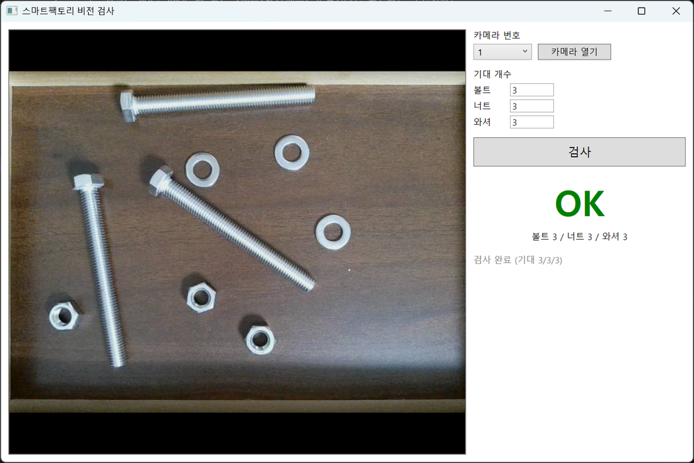
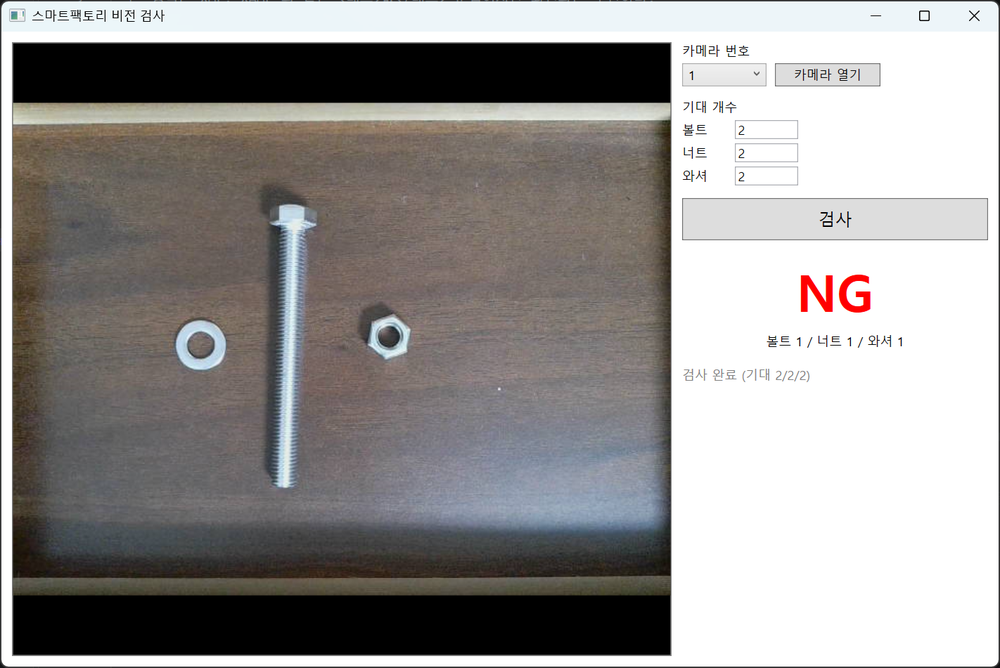
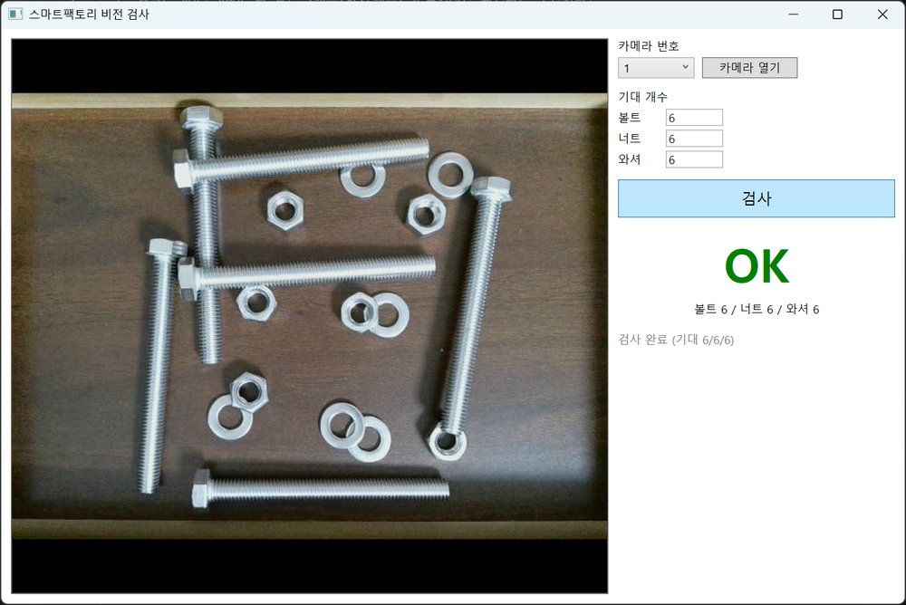
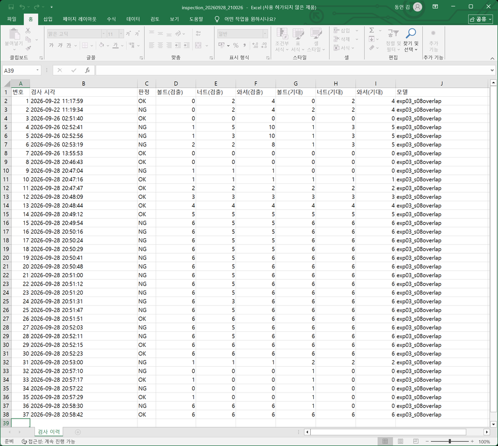

# 스마트팩토리 AI 비전 검사 — 볼트·너트·와셔 수량 검사

웹캠으로 조립 트레이를 촬영하고, **직접 수집·라벨링한 데이터로 파인튜닝한 YOLO**가 볼트·너트·와셔의 개수를 세어 OK/NG를 판정하는 시스템.
판정 결과는 SQL Server에 저장하고 Excel로 추출한다.

| OK — 3/3/3 | NG — 기대 2/2/2, 검출 1/1/1 |
|---|---|
|  |  |

| OK — 6/6/6, 부품이 겹친 배치 | Excel 이력 |
|---|---|
|  |  |

- 기간: 2026-08-07 ~ 09-28 (7.5주, 평일 교육 병행). 1인 포트폴리오
- 목표 직무: AI 비전 검사
- **무게중심은 화면이 아니라 데이터 수집 → 라벨링 → 학습 → 실패 분석 → 재학습 사이클이다.** 세 바퀴 돌았다

---

## 1. 무엇을 만들었나

```
[웹캠] → [WPF 검사 화면 (C#)] ──HTTP: 사진 + 기대 개수──▶ [FastAPI (Python)] → YOLO 추론 → 개수 비교 → OK/NG
              ▲                                                   │
              └──────── {"result": "OK", "counts": {...}} ◀────────┤
                                                                   └──▶ [SQL Server] inspection 표 ──▶ export_excel.py ──▶ .xlsx
```

| 파트 | 내용 | 상태 |
|---|---|---|
| 데이터 | 9세션 320장 촬영(아이폰 2세션 + 웹캠 7세션), Label Studio로 전부 직접 라벨링, 촬영 메타데이터 CSV | ✅ |
| 학습 | Colab T4, YOLO11n 파인튜닝 3회(EXP-01 → 02 → 03). 실패 분석 → 추가 촬영 → 재학습 | ✅ |
| 서버 | FastAPI `POST /inspect` — 사진 + 기대 개수 → 판정. 가운데 1:1 크롭 → 추론 → 클래스별 개수 → 비교 | ✅ |
| DB | SQL Server + SQLAlchemy + Alembic. 검사 1회 = `inspection` 표 1행 (검출·기대 개수, 모델 이름) | ✅ |
| 화면 | WPF — 카메라 선택, 미리보기, 기대 개수 입력, 검사, OK/NG·개수 표시 | ✅ |
| Excel | `inspection` 표 → pandas → `.xlsx` (머리글 한국어, 열 너비 자동) | ✅ |
| 범위 밖 | 이력 조회 화면, Excel 요약 시트, 실시간 바운딩 박스, MVVM | — |

---

## 2. 핵심 — 실패 분석 → 재학습 사이클

**지표는 mAP가 아니라 "사진 단위 개수 정답률"이다.** 볼트 3개를 4개로 세면 mAP는 거의 안 떨어지지만 검사는 NG다.
그래서 학습마다 `predict_count.py`로 사진마다 개수를 세고 `images.csv`(촬영 때 적은 정답)와 대조했다. 그 표가 실패 분석의 재료다.

| 실험 | train | 발견한 실패 | 대응 | 결과 |
|---|---|---|---|---|
| **EXP-01** | 140장 (s01·02·03·06) | val 85.7%. 틀린 것 중 **와셔→너트 3장이 전부 한 방향 조명의 그림자 안** | 가설 H1 "그림자". 같은 조명으로 **그림자 전용 세션 s07** 40장 촬영 | EXP-01 모델의 s07 정답률 **55%** — 가설 확인 |
| **EXP-02** | +s07 = 180장 | val **100%**. 그러나 val(s04)이 s07과 같은 조명이라 후한 점수 | 겹침·가장자리 세션 **s08** 35장 촬영 | EXP-02 모델의 s08 **74.3%**, 틀린 9장 중 8장이 겹침 |
| **EXP-03** | +s08 = 215장 | 교차한 볼트가 토막 나 박스가 하나 더 붙는다 | 운영값 **conf 0.4 · iou 0.5** 확정 (iou 0.5가 중복 박스만 지우는 것을 s08에서 확인) | 최종 test **s09 32/35 = 91.4%** |

**최종 test(s09)는 딱 한 번 채점했다.** 모델이 본 적 없는 방향의 그림자 + 배치 4종.

| 배치 | 맞은 사진 |
|---|---|
| 떨어뜨림 / 붙임 / 가장자리 / 빈 트레이 | **27 / 27** |
| 겹침 | **5 / 8** — 틀린 3장 전부 교차한 볼트를 하나 더 셈 |
| 너트↔와셔 오분류 | **0** |

91.4% 하나로 말하면 어디서 틀리는지가 숨는다. 나눠 말하면 한계와 원인을 안다는 뜻이 된다.
전체 기록: [`docs/experiment-log.md`](docs/experiment-log.md)

### 실제 웹캠 검사 (2026-09-28, 기숙사)

WPF로 30회 라이브 검사. 1/1/1 ~ 6/6/6 순서로 부품을 늘려 가며 OK, 겹친 6/6/6 배치도 OK, **너트를 하나 빼면 NG(검출 6/5/6)** — 의도한 대로 판정했다. 위 스크린샷.
30회 중 모델이 개수를 잘못 센 경우는 없었다. 다만 이것은 기숙사 세팅(레이저 웹캠·삼각대·천장등)에서의 결과이고, 조명·트레이가 다른 곳에서는 재지 않았다.

---

## 3. 데이터를 어떻게 만들었나

| 결정 | 내용 | 왜 |
|---|---|---|
| **세션 단위 분할** (D-003) | Train/Val/Test를 랜덤 셔플이 아니라 **촬영 세션 단위**로 나눈다 | 같은 세션의 사진은 조명·높이·나뭇결이 같다. 섞으면 val이 답안지가 되어 mAP는 높은데 실제로는 안 되는 모델이 나온다 |
| **배경 이미지** (D-005) | 빈 트레이를 클래스로 만들지 않고 negative 이미지로 | "없음"은 클래스가 아니다 |
| **가운데 1:1 크롭** (D-007) | 웹캠 16:9 원본을 중앙 정사각으로 잘라 640으로 | 레터박스는 와셔가 36px로 작아져 놓친다. 같은 사진에서 레터박스 8/6/6 오답 → 크롭 6/6/6 정답을 실측으로 확인 |
| **촬영 계획표 + 검산** (D-008·D-012) | 세션마다 개수 계획표(0~6개 각 5장)를 미리 만들고, `verify_counts.py`로 라벨 개수와 대조 | s01은 35장 중 16장이 계획과 달랐다. 대책(매 장 찍기 전 실물 세기) 후 s02~s09 **어긋남 0건** |
| **다양성은 조명에서** (D-011) | 삼각대 높이 고정, 세션마다 조명만 바꿈 | 프레임 폭 20cm를 지키면서 도메인을 넓히는 유일한 축 |

- 라벨링 규칙: [`docs/labeling-guide.md`](docs/labeling-guide.md) — 잘린 부품, 겹친 부품, 박스 여백을 어떻게 그리나
- 촬영 메타데이터: [`metadata/`](metadata/) — 세션당 1행(`sessions.csv`), 사진당 1행(`images.csv`). 실패 분석의 채점표
- 모든 결정과 근거: [`docs/decisions.md`](docs/decisions.md) D-001 ~ D-012

---

## 4. 기술 스택

| 영역 | 기술 |
|---|---|
| AI | Python 3, PyTorch, Ultralytics YOLO11n, OpenCV. 학습은 Google Colab T4, 추론은 노트북 CPU(0.15초/장) |
| 서버 | FastAPI + uvicorn. 단일 프로세스 (AI 서버를 따로 두지 않음) |
| DB | Microsoft SQL Server 2022 + SQLAlchemy 2.0 + pyodbc + ODBC Driver 18, Alembic 마이그레이션 |
| 화면 | C# / .NET 10 / WPF, OpenCvSharp4 (웹캠), HttpClient (서버 호출) |
| Excel | pandas + openpyxl |
| 라벨링 | Label Studio (로컬) |

**저장은 ORM, 추출은 SQL.** `main.py`는 `session.add(Inspection(...))`로 저장하고, `export_excel.py`는 `SELECT * FROM inspection`으로 읽는다.

---

## 5. 실행

### 준비 (한 번)

```powershell
# Python
cd ai-server
python -m venv .venv
.venv/Scripts/pip install -r requirements.txt
copy .env.example .env        # DB 접속 정보 채우기 (서버, DB 이름, 계정, 비밀번호)
.venv/Scripts/python check_db.py           # 접속 확인
.venv/Scripts/alembic upgrade head         # inspection 표 생성

# 모델: runs/exp03_s08overlap/weights/best.pt 를 main.py 의 WEIGHTS 경로에 (git 제외, Drive 원본)
```

SQL Server는 혼합 모드 인증 + TCP/IP 활성화가 전제다. 막힌 것과 해결은 [`docs/setup-log.md`](docs/setup-log.md).

### 시연 (터미널 2개)

| | 어디서 | 명령 |
|---|---|---|
| 서버 | `ai-server` | `.venv/Scripts/uvicorn main:app` |
| 화면 | 최상위 | `dotnet run --project wpf-client` |
| Excel | `ai-server` | `.venv/Scripts/python export_excel.py` → `storage/inspection_날짜.xlsx` |

화면에서 카메라 번호(내장 0 / USB 1) → 카메라 열기 → 트레이를 정중앙에 → 기대 개수 → 검사.
서버만 시험하려면 `http://localhost:8000/docs`.

### 데이터 파이프라인 (스크립트)

```
촬영 → scripts/rename_session.py  (EXIF 시각순으로 sXX_NNN 이름)
     → scripts/crop_session.py    (웹캠 16:9 → 중앙 1:1)
     → Label Studio 라벨링 → export
     → scripts/verify_counts.py   (라벨 개수 ↔ images.csv 대조)
     → scripts/split_dataset.py   (세션 단위 train/val/test)
     → scripts/train.py           (Colab)
     → scripts/predict_count.py   (사진별 개수 채점 — 실패 분석 재료)
```

---

## 6. 폴더

```
├── ai-server/          FastAPI(main.py) · DB(db.py, models.py, migrations/) · export_excel.py
├── wpf-client/         WPF 검사 화면 (MainWindow.xaml / .xaml.cs)
├── scripts/            데이터 파이프라인 6개
├── metadata/           sessions.csv · images.csv (촬영 기록. git 에 남는 유일한 데이터 근거)
├── docs/               아래 7절
├── data.yaml           YOLO 데이터셋 설정
├── dataset/ models/ runs/ storage/   git 제외 (이미지·가중치·산출물)
```

---

## 7. 문서

이 프로젝트는 "만든 것"만큼 "왜 그렇게 했는지"를 남기는 데 시간을 썼다.

| 문서 | 내용 |
|---|---|
| [`docs/decisions.md`](docs/decisions.md) | 결정 12개. 선택지·근거·감수한 것·뒤집는 조건 |
| [`docs/experiment-log.md`](docs/experiment-log.md) | EXP-01~03 설정·결과·해석·가설 |
| [`docs/labeling-guide.md`](docs/labeling-guide.md) | 라벨링 규칙과 변경 이력 |
| [`docs/daily-log.md`](docs/daily-log.md) | 작업 일지. 환경·설정 변경을 날짜별로 |
| [`docs/status.md`](docs/status.md) | 진행 상황판 |
| [`docs/foundations.md`](docs/foundations.md) | YOLO·FastAPI·DB·WPF 기반 지식 정리 |
| [`docs/work-grades.md`](docs/work-grades.md) | 작업별 A/B/C 등급 — AI 도구를 어디까지 쓸지 미리 정한 기준 |

**AI 도구 사용에 대해.** 작업을 A/B/C로 나눠 A등급(촬영 설계, 라벨링, 분할 기준, 학습, 실패 분석, 실험 기록)은 직접 하고, B등급은 뼈대만 받고, C등급(환경 구축)은 위임했다.
일정이 밀리면서 규칙을 두 번 바꿨다(주석 위임, 원서 모드). 언제 무엇을 왜 바꿨는지는 `work-grades.md`와 `decisions.md` D-001에 있다.

---

## 8. 한계와 다음

- **겹침 배치 5/8.** 볼트가 교차하면 하나 더 센다. 겹침 세션을 35장 더 찍어 재학습하는 것이 첫 번째
- **라이브 검사는 한 세팅에서 30회뿐.** 라이브 프레임을 저장하지 않아 나중에 틀린 검사를 되짚을 수 없다 (사진 경로 컬럼 추가 = Alembic 두 번째 마이그레이션이 다음)
- **대조 실험 없음.** EXP-02의 향상이 40장이 늘어서인지 그림자 사진이라서인지 못 가른다
- test가 35장 한 세션(s09)뿐. 다른 트레이·높이는 재지 않았다
- 화면은 코드 비하인드 하나. MVVM 아님

---

## 라이선스

Ultralytics YOLO는 AGPL-3.0. 이 저장소는 개인 포트폴리오로 공개한다. 데이터셋과 가중치는 저장소에 포함하지 않는다.
