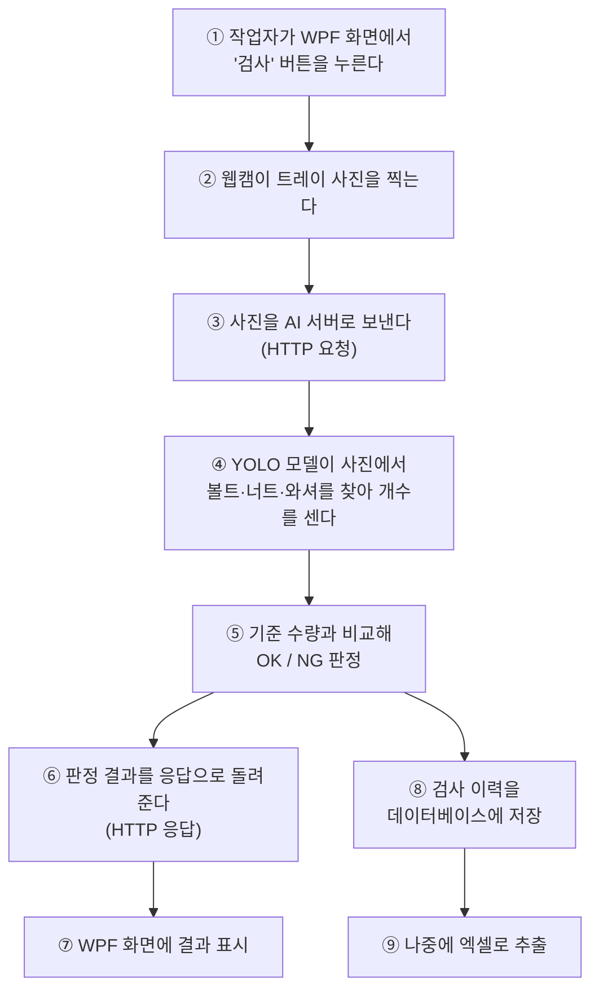
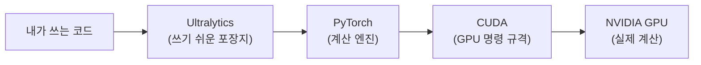
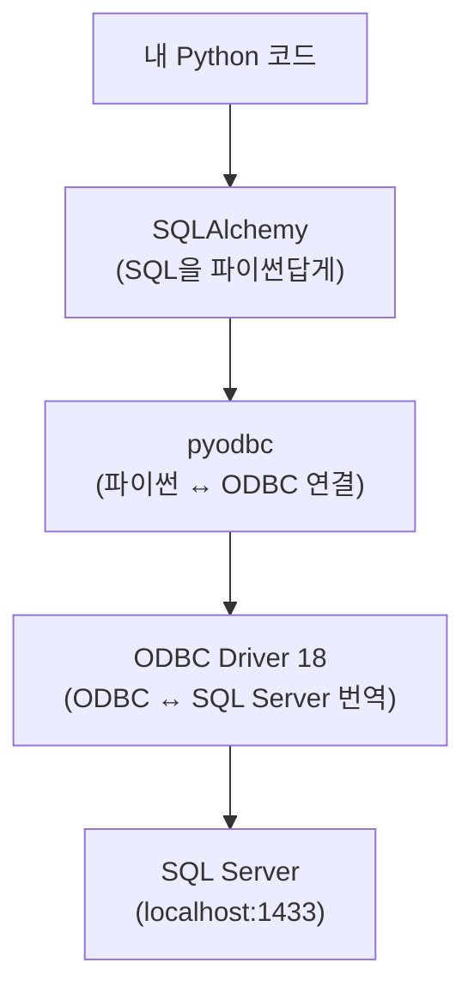
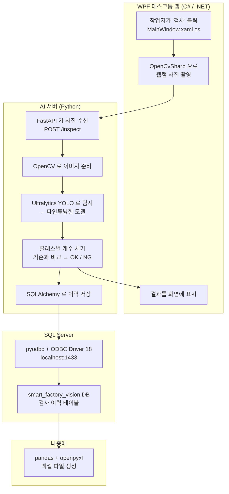
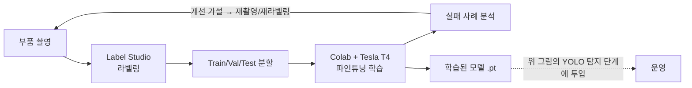

# 기반 지식 — 이 프로젝트에 나오는 것들이 각각 무엇이고 어떻게 연결되는가

> **이 문서는 무엇인가**
> `setup-log.md`가 "무엇을 실행했는가"의 기록이라면, 이 문서는 **"그게 다 뭐고 왜 필요한가"**의 설명이다.
> 처음 보는 용어를 하나도 안다고 가정하지 않는다.
>
> **읽는 법**
> 1장(전체 그림)을 먼저 읽고, 나머지는 필요할 때 찾아 읽으면 된다.
> 각 장은 **① 이 파트가 하는 일 → ② 그래서 필요한 도구 → ③ 그중 우리가 고른 것 → ④ 프로젝트에서 어떻게 쓰이나** 순서다.

---

## 1. 전체 그림 — 이 프로젝트는 결국 무슨 일을 하는가

한 문장으로:

> **웹캠으로 조립 트레이를 찍어서, 볼트·너트·와셔가 몇 개씩 있는지 AI가 세고, 정해진 수량과 맞으면 OK 아니면 NG로 판정하고, 그 결과를 데이터베이스에 저장한 뒤 엑셀로 뽑는다.**

이걸 시간 순서로 따라가면 이렇게 됩니다.



여기서 **서로 다른 세 개의 프로그램**이 돌아갑니다.

| 프로그램 | 언어 | 하는 일 | 이 프로젝트에서의 이름 |
|---|---|---|---|
| 데스크톱 앱 | C# / WPF | 화면, 웹캠 촬영, 결과 표시 | `wpf-client` |
| AI 서버 | Python / FastAPI | 사진 받아서 판정, DB 저장 | `ai-server` |
| 데이터베이스 | (SQL) | 검사 이력 보관 | SQL Server |

**왜 하나로 안 만드나?** 언어가 달라서입니다. YOLO 같은 AI 모델은 Python 생태계에만 제대로 있고, WPF 화면은 C#으로만 만들 수 있습니다. C# 프로그램이 Python 함수를 직접 부를 수는 없습니다. 그래서 **둘 사이에 "서버"라는 통역사**를 둡니다. 이게 FastAPI의 존재 이유입니다.

> **중요:** 이 프로젝트의 무게중심은 ①②③⑦(화면)이 **아니라** ④(AI가 제대로 세는가)입니다.
> 화면은 결과를 보여주는 껍데기고, 진짜 어려운 건 "모델이 와셔를 너트로 착각하는 걸 어떻게 고칠 것인가"입니다.

---

## 2. AI 비전 파트 — 사진에서 부품을 찾아 세는 일

### 2-1. 그래서 정확히 무슨 문제를 푸는 건가

컴퓨터 비전에는 비슷해 보이지만 다른 문제들이 있습니다.

| 문제 유형 | 질문 | 출력 | 우리에게 맞나 |
|---|---|---|---|
| **분류**(Classification) | "이 사진은 무엇인가?" | `볼트` | ✗ 개수를 못 셈 |
| **객체 탐지**(Object Detection) | "무엇이 **어디에** 몇 개 있는가?" | `볼트 3개 + 각각의 위치` | **✓ 이것** |
| **분할**(Segmentation) | "픽셀 단위로 어디까지가 그 물체인가?" | 물체 외곽선 | ✗ 과함 |

우리는 **개수를 세야** 하므로 객체 탐지입니다. 분류는 사진 한 장에 답 하나만 주기 때문에 "볼트 3개, 너트 2개"를 표현할 수 없습니다.

**객체 탐지의 출력**은 이렇게 생겼습니다.

```
탐지 1: 클래스=볼트,  신뢰도=0.94,  위치=[x1=120, y1=88,  x2=180, y2=150]
탐지 2: 클래스=볼트,  신뢰도=0.91,  위치=[x1=240, y1=95,  x2=298, y2=155]
탐지 3: 클래스=너트,  신뢰도=0.87,  위치=[x1=310, y1=200, x2=350, y2=240]
```

- **바운딩 박스(bounding box)**: 물체를 감싸는 네모. `x1,y1`은 왼쪽 위 모서리, `x2,y2`는 오른쪽 아래 모서리 좌표입니다.
- **신뢰도(confidence)**: 모델이 얼마나 확신하는지. 0~1 사이 값. 보통 0.5 미만은 버립니다.
- **클래스(class)**: 무엇으로 판단했는지. 우리는 `볼트`, `너트`, `와셔` 3개를 쓸 예정입니다.

**개수 세기**는 여기서 그냥 클래스별로 세면 됩니다. "볼트 2개, 너트 1개". 이걸 기준 수량과 비교하면 OK/NG가 나옵니다.

### 2-2. YOLO가 무엇인가

**YOLO = You Only Look Once.** 객체 탐지를 하는 **AI 모델의 한 종류(계열)**입니다.

이름의 뜻이 곧 특징입니다. 옛날 방식은 사진을 여러 조각으로 나눠 "여기 뭐 있나? 여기는?" 하고 **여러 번 훑었습니다.** YOLO는 **사진을 딱 한 번만 보고** 모든 물체의 위치와 종류를 한꺼번에 내놓습니다. 그래서 빠릅니다. 실시간 검사에 쓸 수 있는 이유입니다.

- 여러 버전이 있습니다(YOLOv5, v8, v11...). 우리는 Ultralytics가 배포하는 최신 계열을 씁니다.
- 모델은 크기별로 나뉩니다: `n`(nano, 가장 작고 빠름) → `s` → `m` → `l` → `x`(가장 크고 정확). 부품 3종 세는 데는 작은 것으로 충분합니다.

### 2-3. 파인튜닝(fine-tuning)이 무엇이고 왜 하는가

**우리가 쓸 YOLO는 이미 학습이 되어 있습니다.** 다만 사람·자동차·개·고양이 같은 일반 사물 80종을 아는 모델입니다. **볼트와 너트는 모릅니다.**

여기서 두 가지 선택지가 있습니다.

| 방법 | 필요한 데이터 | 필요한 시간 | 현실성 |
|---|---|---|---|
| 처음부터 학습 (from scratch) | 수십만 장 | 수 주 | ✗ 불가능 |
| **파인튜닝** (fine-tuning) | **수백 장** | **수십 분** | **✓ 이것** |

**파인튜닝은 "이미 눈이 좋은 모델에게 새 물체만 추가로 가르치는 것"입니다.**

비유하자면, 이미 사물을 볼 줄 아는 사람에게 "이건 볼트, 이건 너트야"라고 가르치는 것과, 갓난아기에게 시각부터 가르치는 것의 차이입니다. 앞의 것이 훨씬 적은 예시로 됩니다.

기술적으로는, 모델이 이미 배운 **"모서리·질감·형태를 알아보는 능력"은 그대로 두고**, 마지막 "이게 무슨 물체인지 정하는 부분"만 우리 데이터로 다시 학습시킵니다. 이걸 **전이 학습(transfer learning)**이라고도 합니다.

> **이 프로젝트에서 가장 중요한 부분이 여기입니다.**
> 파인튜닝은 "데이터를 넣고 버튼 누르기"가 아닙니다.
> 사진을 어떻게 찍을지, 어디까지를 라벨로 칠지, 실패했을 때 원인이 데이터인지 모델인지 —
> 이 판단들이 성능의 대부분을 결정합니다. work-grades.md가 이 부분을 전부 A등급으로 둔 이유입니다.

### 2-4. 라벨링이 무엇인가

모델에게 가르치려면 **정답지**가 필요합니다. 사진마다 "여기 볼트가 있다"고 사람이 표시해주는 작업이 **라벨링(labeling / annotation)**입니다.

실제로 하는 일: 사진을 열고 → 볼트 주위에 마우스로 네모를 그리고 → "볼트"라고 지정. 부품 하나당 한 번씩. 사진 500장이면 수천 번입니다.

결과물은 사진 한 장당 텍스트 파일 하나입니다(YOLO 형식).

```
0 0.412 0.331 0.085 0.120
0 0.633 0.348 0.081 0.118
1 0.501 0.702 0.062 0.061
```

- 첫 숫자 = 클래스 번호 (0=볼트, 1=너트, 2=와셔 같은 식)
- 나머지 4개 = 박스의 중심 x, 중심 y, 너비, 높이 — **사진 크기 대비 비율**(0~1)
- 비율로 적는 이유: 사진 크기가 달라져도 그대로 쓸 수 있어서

**왜 이걸 남에게 못 맡기나.** "와셔가 절반 가려졌으면 라벨을 다나?" "두 개가 겹쳐 있으면?" 이런 판단이 계속 나오는데, 여기서 **일관성이 무너지면 모델이 혼란스러워집니다.** 라벨링 규칙을 정하는 것(`labeling-guide.md`)이 A등급인 이유입니다.

### 2-5. 데이터를 왜 세 덩어리로 나누나 — Train / Val / Test

라벨링이 끝난 사진 뭉치를 그대로 학습에 다 넣지 않습니다. **세 덩어리로 나눕니다.**

이유는 하나입니다. **공부한 문제로 시험을 보면 실력을 알 수 없기 때문**입니다. 모델은 학습에 쓴 사진은 거의 다 맞힙니다. 외웠으니까요. 그 점수는 "얼마나 잘 외웠나"이지 "처음 보는 트레이를 맞힐 수 있나"가 아닙니다.

| | Train (학습) | Val (검증) | Test (시험) |
|---|---|---|---|
| 모델이 **학습에** 쓰나 | 예 | 아니오 | 아니오 |
| **내가** 몇 번 보나 | — | **수십 번** | **딱 한 번** |
| 용도 | 가중치를 조정한다 | 학습 도중 감시, 설정을 바꿀 근거 | 최종 성적표 |
| 비율(대략) | 70~80% | 10~15% | 10~15% |

**Val과 Test의 차이가 헷갈리는 게 정상입니다.** 둘 다 "학습에 안 쓰는 데이터"라서 같아 보입니다. 차이는 **모델이 보느냐가 아니라 내가 몇 번 보느냐**입니다.

Val은 학습 중 매 epoch(전체 데이터를 한 바퀴 도는 단위)마다 자동으로 평가되고, 그 숫자를 보면서 내가 판단합니다.

- "Val 성능이 아직 오르네 → epochs를 늘리자"
- "Val이 나빠지기 시작했네 → 여기서 멈추자" (**과적합**의 신호)
- "이미지 크기를 640에서 960으로 바꿔볼까"

이때 **Val 점수가 모델을 고르는 데 개입합니다.** 그래서 Val은 엄밀히 말해 "안 본 데이터"가 아니라 **간접적으로 학습에 참여한 데이터**입니다. 이 점수를 최종 성능이라고 발표하면 부풀려진 숫자입니다.

Test는 그래서 **모든 실험이 끝날 때까지 봉인해두는 데이터**입니다. 마지막에 딱 한 번 씁니다.

> **비유**
> Val은 모의고사입니다. 여러 번 보고, 틀린 데를 보완하고, 공부 방향을 바꿉니다.
> Test는 수능입니다. 한 번뿐이고, 그 결과가 실력입니다.
> 수능 문제를 미리 풀어보고 채점했다면, 그건 더 이상 수능이 아닙니다.

**여기서 나오는 실전 규칙 하나.** 이 프로젝트는 "학습 → 실패 분석 → 재학습" 사이클을 여러 번 돕니다(work-grades #21). 이때 **Test 점수를 보고 "성능이 별로네, 다시 학습하자"를 반복하면 Test도 Val이 됩니다.** 사이클을 도는 동안 판단 근거는 Val이어야 하고, Test는 아껴야 합니다.

#### 데이터 누수 (data leakage)

**학습에 쓴 정보가 평가 데이터에 새어 들어가서, 점수가 실제 실력보다 높게 나오는 현상**입니다. 위에서 말한 "Test를 여러 번 보는 것"도 누수의 일종이고, 이 프로젝트에서 훨씬 더 위험한 형태가 따로 있습니다.

트레이를 한 번 세팅하고 각도만 조금씩 바꿔 30장을 찍었다고 합시다. 이 30장은 사람 눈에도 거의 같은 사진입니다. 이걸 **랜덤으로 섞어서** Train과 Test에 나눠 담으면, Test에 들어간 사진과 거의 똑같은 사진이 Train에도 있습니다.

```
같은 세팅 30장 ──랜덤 셔플──▶ Train: 1,2,4,5,7,8,...
                              Test:  3,6,9,...   ← 3번은 2번, 4번과 거의 같은 사진
```

모델 입장에서 Test는 **이미 외운 사진**입니다. 점수는 98%가 나오지만, 실제로 새 트레이를 찍어 넣으면 무너집니다. **mAP는 높은데 현장에서 동작하지 않는 모델**이 이렇게 만들어집니다.

일반적인 이미지 분류 튜토리얼(고양이/개 사진 수만 장)에서는 랜덤 셔플이 문제가 안 됩니다. 사진끼리 서로 독립적이기 때문입니다. **직접 촬영한 소규모 데이터셋은 사진끼리 독립적이지 않습니다.** 이게 결정적인 차이입니다.

#### 그래서 세션 단위로 나눈다

**촬영 세션 = 한 번 자리를 잡고 앉아서 이어서 찍은 사진 묶음.** 일어났다 다시 세팅하면 새 세션입니다.

분할할 때 사진 한 장 한 장을 나누는 게 아니라 **세션을 통째로** 어느 한쪽에 넣습니다.

```
세션 A (휴대폰, 주간, 책상)  ─┐
세션 B (휴대폰, 야간, 책상)  ─┼─▶ Train
세션 C (휴대폰, 주간, 조명 이동) ─┘
세션 D (웹캠, 주간)          ───▶ Val
세션 E (웹캠, 야간)          ───▶ Test   ← Train에 같은 세션의 사진이 하나도 없다
```

이렇게 하면 Test 세션의 사진은 **정말로 모델이 처음 보는 조건**입니다. 실무에서는 이런 분할을 **그룹 분할(group split)** 이라고 부릅니다. 같은 그룹(여기서는 세션)에 속한 데이터가 학습과 평가에 쪼개져 들어가지 않게 막는 방식입니다.

**세션을 무엇으로 가를 것인가**는 이 프로젝트에서 직접 정할 부분입니다(work-grades #13, A등급). 판단 기준은 하나입니다 — **그것이 바뀌면 사진이 눈에 띄게 달라지는가.**

| 후보 | 세션을 가르는 기준이 되나 |
|---|---|
| 카메라 (휴대폰 / 웹캠) | **가장 중요합니다.** 2-6절 참고 |
| 촬영 날짜·시간대 | 좋습니다. 조명·위치·손 각도가 통째로 달라집니다 |
| 조명 조건 (주간/야간, 조명 위치) | 좋습니다 |
| 촬영 장소 | 좋습니다 |
| 부품 배치 | 아닙니다. **세션 안에서 바뀌는 변수**로 둡니다 |

부품 배치를 세션 기준으로 잡으면 세션이 수십 개가 되는데, 세션끼리 차이가 거의 없어서 **결국 랜덤 셔플과 같아집니다.** 나누는 목적이 사라집니다.

#### 세션 분할이 치르는 대가

공짜가 아닙니다. 결정 기록에 이 두 가지를 반드시 적어야 합니다.

1. **비율을 정확히 맞출 수 없습니다.** 세션이 6개인데 Test에 1개를 떼면 정확히 10%가 아니라 16%일 수도 있습니다. 사진 장수가 세션마다 다르니까요.
2. **클래스가 한쪽으로 쏠릴 수 있습니다.** 와셔를 많이 배치한 세션이 통째로 Test로 가면, Train에 와셔가 부족해지고 Test는 와셔 위주가 됩니다. 랜덤 셔플이었다면 확률적으로 고르게 퍼졌을 것입니다.

→ 그래서 **분할한 뒤에 세 셋의 클래스별 개수를 세어서 확인하는 절차**가 필요합니다. 이건 분할 스크립트(work-grades #14)에서 직접 구현하게 됩니다.

3. **세션 수가 적으면 Test 점수가 불안정합니다.** Test 세션이 1개뿐이면, 그 세션이 유난히 쉬웠거나 어려웠을 때 점수가 통째로 흔들립니다. 세션을 넉넉히 확보해야 하는 이유입니다.

### 2-6. 도메인 갭 — 학습한 사진과 실제로 들어올 사진이 다르다

**도메인 갭(domain gap)** 은 **모델이 학습한 데이터의 분포와, 실제 운영에서 들어오는 데이터의 분포가 다른 것**을 말합니다. 도메인 시프트(domain shift)라고도 합니다.

이 프로젝트에는 처음부터 알려진 도메인 갭이 하나 있습니다.

> **학습 데이터는 주로 휴대폰으로 찍고, 실제 운영은 웹캠으로 한다.**

같은 트레이를 찍어도 두 사진은 상당히 다릅니다.

| 항목 | 휴대폰 | 웹캠 |
|---|---|---|
| 해상도 | 높음 (1200만 화소 이상) | 낮음 (보통 200만 화소) |
| 색감·화이트밸런스 | 자동 보정이 강함 | 보정이 약하고 누렇거나 푸르게 나옴 |
| 초점 | 자동 초점이 정확 | 고정 초점이거나 느림 |
| 노이즈 | 적음 | 어두우면 많이 낌 |
| 렌즈 왜곡 | 적음 | 가장자리가 휘는 경우가 있음 |

모델은 **"금속 부품의 모양"만 배우는 게 아니라 사진의 이런 특성까지 같이 배웁니다.** 그래서 휴대폰 사진만으로 학습하면, 웹캠 사진이 들어왔을 때 "내가 배운 것과 다른 종류의 이미지"가 되어 성능이 떨어집니다.

**증상이 고약합니다.** 에러가 나지 않습니다. mAP는 0.95인데 실제 웹캠 화면에서는 와셔를 절반도 못 잡습니다. 숫자만 보고 있으면 배포 직전까지 모릅니다.

#### 대응 방법 세 가지

1. **Test 셋에 웹캠 세션을 반드시 포함한다.** 이게 최소한의 방어입니다. Test가 운영 조건을 닮지 않으면, Test 점수는 운영 성능을 예측하지 못합니다. **Test 셋은 "안 본 사진"이면 되는 게 아니라 "운영 조건을 닮은 사진"이어야 합니다.**
2. **학습 데이터에도 웹캠 사진을 섞는다.** 갭을 줄이는 가장 확실한 방법입니다. 다만 웹캠 촬영은 손이 더 가므로 분량 배분을 판단해야 합니다.
3. **증강(augmentation)으로 견디게 만든다.** 학습할 때 사진의 밝기·색조·노이즈를 일부러 흔들어서, 모델이 특정 촬영 조건에 덜 의존하게 만듭니다. YOLO는 이 기능을 기본으로 갖고 있습니다.

#### 카메라만이 도메인 갭이 아니다

조명, 배경, 촬영 각도, 부품의 개체 차이(같은 규격이라도 도금 상태가 다른 볼트) 전부 도메인 갭의 원인입니다. 기숙사 책상에서만 찍은 데이터로 학습하면, 배경이 바뀌었을 때 어떻게 될지 알 수 없습니다.

> **혼동하기 쉬운 것:** "학습은 Colab(리눅스·GPU), 실행은 노트북(윈도우·CPU)"에서 생기는 문제는 도메인 갭이 **아닙니다.**
> 그건 **재현성 문제**입니다 — PyTorch/Ultralytics 버전이 다르면 모델 파일을 못 읽거나 경고가 나고, 학습 때 쓴 이미지 크기(`imgsz`)와 추론 때 쓴 크기가 다르면 성능이 조용히 떨어집니다.
> 도메인 갭은 **사진이 달라서** 생기는 문제, 재현성은 **코드와 설정이 달라서** 생기는 문제입니다. 대응 방법도 다릅니다(전자는 데이터, 후자는 버전 고정).

### 2-7. 학습에 GPU가 왜 필요한가 — CUDA와 Colab

**GPU(그래픽 카드)는 원래 화면을 그리는 부품**입니다. 그런데 화면 그리기는 "수많은 픽셀에 같은 계산을 동시에 적용하는" 일이고, **AI 학습도 정확히 같은 모양의 계산**입니다. 그래서 GPU가 AI에 쓰입니다.

- **CPU**: 복잡한 일을 하나씩 빠르게 (직원 8명이 각자 다른 일)
- **GPU**: 단순한 일을 수천 개 동시에 (알바 3000명이 똑같은 일)

AI 학습은 후자라 GPU가 수십~수백 배 빠릅니다. CPU로 3일 걸릴 학습이 GPU로 1시간입니다.

**CUDA**는 NVIDIA가 만든, GPU에게 이런 계산을 시키는 소프트웨어 규격입니다. 문제는 **NVIDIA GPU에서만 동작한다**는 것입니다.

> 이 노트북의 GPU는 **Intel Arc 130V** — NVIDIA가 아닙니다. 그래서 CUDA를 못 씁니다.
> 이것이 **학습을 Google Colab에서 하는 이유**입니다.

**Google Colab**은 구글이 브라우저에서 무료로 빌려주는 Python 실행 환경이고, NVIDIA GPU(우리는 **Tesla T4**를 배정받았습니다)를 쓸 수 있습니다.

주의할 점 두 가지:
- **런타임이 끊기면 그 안의 파일은 전부 사라집니다.** 그래서 데이터셋과 학습 결과를 **Google Drive에 두고 연결(마운트)**합니다. 오늘 `MyDrive/smart-factory-vision` 폴더를 만든 이유입니다.
- 노트북에서는 **스모크 테스트**(코드가 에러 없이 도는지 확인)만 합니다. 진짜 학습은 Colab.

### 2-8. 이 파트에서 쓰는 도구들

| 도구 | 무엇인가 | 이 프로젝트에서 하는 일 |
|---|---|---|
| **PyTorch** (`torch`) | 딥러닝 프레임워크. 신경망을 만들고 학습시키는 **엔진** | YOLO가 내부적으로 이걸로 돌아간다. 직접 만질 일은 거의 없다 |
| **Ultralytics** | YOLO를 **쉽게 쓰게 해주는 포장지**. `model.train()` 한 줄로 학습이 된다 | 학습·추론의 실제 진입점 |
| **OpenCV** (`cv2`) | 이미지·영상 처리 라이브러리 | 웹캠에서 프레임 읽기, 이미지 크기 조정, 바운딩 박스 그리기 |
| **Label Studio** | 라벨링 도구 | 사진에 네모 치고 클래스 지정 → YOLO 형식으로 내보내기 |

**관계를 그림으로:**



노트북에는 D·E가 없어서 C가 CPU로 대신 돕니다. 느리지만 동작은 합니다.

---

## 3. 서버 파트 — FastAPI

### 3-1. 왜 서버가 필요한가

앞에서 말한 대로, **C# 프로그램이 Python 함수를 직접 부를 수 없기 때문**입니다.

해결책은 **HTTP**라는 공통 언어로 대화하는 것입니다. 인터넷 브라우저가 웹사이트와 대화하는 바로 그 방식입니다.

```
WPF (C#)  ──[사진 데이터를 담은 HTTP 요청]──▶  FastAPI (Python)
          ◀──[판정 결과를 담은 HTTP 응답]───
```

이렇게 하면 서로 무슨 언어로 만들어졌는지 몰라도 됩니다. **약속된 형식으로 주고받기만 하면 됩니다.**

### 3-2. API가 무엇인가

**API(Application Programming Interface)** = 프로그램끼리 대화하는 **약속된 창구**입니다.

식당 비유가 잘 맞습니다.
- 손님(WPF)은 주방(YOLO 모델)에 직접 들어가지 않습니다
- **메뉴판(API 명세)**을 보고 **웨이터(FastAPI)**에게 주문합니다
- 웨이터가 주방에 전달하고 음식을 가져옵니다

우리가 만들 창구는 대략 이런 모양이 될 겁니다.

```
POST /inspect        ← 사진을 보내면 OK/NG 판정을 돌려준다
GET  /history        ← 지난 검사 이력을 돌려준다
```

- `POST`, `GET`은 HTTP **메서드**입니다. 대략 `GET`=달라, `POST`=보낸다/처리해달라.
- `/inspect`는 **경로(엔드포인트)**. 창구 번호라고 보면 됩니다.

### 3-3. FastAPI와 uvicorn

| 도구 | 무엇인가 |
|---|---|
| **FastAPI** | Python으로 API를 만드는 프레임워크. "이 경로로 요청이 오면 이 함수를 실행하라"를 간단히 쓸 수 있게 해준다 |
| **uvicorn** | FastAPI로 만든 앱을 **실제로 띄워서 요청을 받게 하는 프로그램**(서버) |

둘의 관계: FastAPI는 **설계도**, uvicorn은 **그 건물을 실제로 세워 문을 여는 것**입니다. FastAPI만으로는 아무 일도 일어나지 않습니다.

`python-multipart`는 **파일 업로드**를 받기 위해 필요합니다. 사진처럼 큰 데이터를 HTTP로 보낼 때 쓰는 형식(`multipart/form-data`)을 처리해줍니다.

> **참고:** CLAUDE.md에 "AI 서버를 별도로 분리하지 않고 단일 프로세스"라고 되어 있습니다.
> 즉 FastAPI 앱 하나 안에 YOLO 모델도 같이 올라갑니다. 프로그램을 더 쪼개지 않습니다.

---

## 4. 데이터베이스 파트 — SQL Server

### 4-1. 왜 DB가 필요한가 (엑셀이나 파일로 하면 안 되나)

검사 이력이 하루 수백 건 쌓입니다. 파일로 관리하면 이런 게 안 됩니다.

- "지난주 NG만 골라서 보여줘" → 파일 전체를 읽어서 직접 걸러야 함
- 두 프로그램이 동시에 쓰면 → 파일이 깨짐
- 100만 건이 되면 → 느려서 못 씀

**데이터베이스는 이걸 전문으로 하는 프로그램**입니다. 표(테이블) 형태로 데이터를 저장하고, 조건 검색·정렬·동시 접근을 안전하게 처리합니다.

### 4-2. SQL이 무엇인가

**SQL(Structured Query Language)** = 데이터베이스에게 시키는 **명령어**입니다. 영어 문장에 가깝게 생겼습니다.

```sql
-- 검사 이력에서 NG 판정만 최근 순으로 10건 가져와라
SELECT * FROM inspection WHERE result = 'NG' ORDER BY created_at DESC;

-- 새 검사 결과를 한 줄 넣어라
INSERT INTO inspection (result, bolt_count) VALUES ('OK', 3);
```

오늘 실행한 것들도 전부 SQL입니다.

```sql
CREATE DATABASE [smart_factory_vision]   -- 데이터베이스를 만들어라
CREATE LOGIN [sfv_app] WITH PASSWORD ... -- 로그인 계정을 만들어라
ALTER LOGIN [sa] DISABLE                 -- sa 계정을 잠가라
```

### 4-3. SQL Server의 구조 — 서비스, 인스턴스, 데이터베이스

용어가 층층이라 헷갈리는데 이렇게 정리하면 됩니다.

```
SQL Server (제품)
 └─ 인스턴스 (설치된 실체, 이름: MSSQLSERVER = 기본 인스턴스)
     └─ 데이터베이스 (여러 개 가능)
         ├─ master        (SQL Server 자기 관리용, 자동 생성)
         ├─ tempdb        (임시 작업용, 자동 생성)
         └─ smart_factory_vision  ← 우리가 만든 것
             └─ 테이블 (앞으로 만들 것: 검사 이력 등)
```

- **서비스(Windows Service)**: SQL Server는 창이 뜨는 프로그램이 아니라 **백그라운드에서 항상 켜져 있는 프로그램**입니다. 윈도우는 이런 것을 "서비스"라고 부릅니다. 오늘 `MSSQLSERVER 서비스: Running`을 확인한 게 이겁니다. 이게 꺼져 있으면 아무것도 접속 못 합니다.
- **인스턴스**: 한 PC에 SQL Server를 여러 벌 설치할 수 있는데, 그 한 벌을 인스턴스라고 합니다. 우리는 **기본 인스턴스**로 설치해서 `localhost`만으로 접속됩니다. 이름 붙은 인스턴스였다면 `localhost\SQLEXPRESS`처럼 써야 합니다.
- **`master.mdf`**: SQL Server가 자기 설정을 담아두는 시스템 파일. 오늘 4번째 설치 실패의 원인이 **이 파일이 이미 있어서**였습니다.

### 4-4. 인증 — 누구인지 확인하는 방법

SQL Server에 접속하려면 신원을 밝혀야 합니다. 두 가지 방식이 있습니다.

| 방식 | 설명 | 우리 프로젝트에서 |
|---|---|---|
| **Windows 인증** | "지금 이 PC에 로그인한 윈도우 계정"을 그대로 신원으로 씀. 별도 비밀번호 없음 | 내가 관리 작업할 때 |
| **SQL 인증** | SQL Server가 따로 관리하는 아이디/비밀번호 | **Python 코드가 접속할 때** |

**혼합 모드(Mixed Mode)** = 둘 다 허용. Windows 인증만 켜면 SQL 인증이 거부됩니다.

> **왜 우리에게 혼합 모드가 필요한가:**
> Python 코드가 접속할 때 아이디/비밀번호를 쓰려면 SQL 인증이 켜져 있어야 합니다.
> 기본 설치는 Windows 인증 전용이라, 오늘 설치 명령에 `/SECURITYMODE=SQL`을 넣어 처음부터 혼합 모드로 깔았습니다.

### 4-5. 로그인 vs 사용자 vs 역할 — 권한 3층 구조

여기가 SQL Server에서 가장 헷갈리는 부분입니다. **층이 다릅니다.**

```
[서버 층]  로그인(Login)     → "이 SQL Server에 들어올 수 있는가"    예: sfv_app, sa
              ↓ 연결
[DB 층]    사용자(User)      → "이 데이터베이스 안에 들어올 수 있는가"  예: sfv_app
              ↓ 소속
[권한]     역할(Role)        → "그 안에서 뭘 할 수 있는가"           예: db_owner
```

건물 비유:
- **로그인** = 건물 출입증 (건물에 들어올 수 있다)
- **사용자** = 특정 사무실 출입증 (그 방에 들어갈 수 있다)
- **역할** = 그 방에서의 직급 (읽기만 가능 / 뭐든 가능)

오늘 한 작업을 이 구조로 다시 보면:

```sql
CREATE LOGIN [sfv_app] ...                 -- ① 건물 출입증 발급
CREATE USER  [sfv_app] FOR LOGIN [sfv_app] -- ② 우리 DB 사무실 출입증 발급
ALTER ROLE db_owner ADD MEMBER [sfv_app]   -- ③ 그 사무실 안에서는 전권
ALTER LOGIN [sa] DISABLE                   -- ④ 마스터키 계정은 잠금
```

**주요 역할:**
- `sysadmin` — **서버 전체** 최고 권한. 모든 DB를 삭제할 수도 있음
- `db_owner` — **그 DB 안에서만** 전권. 테이블 생성·삭제 가능, 다른 DB는 못 건드림
- `db_datareader` / `db_datawriter` — 읽기만 / 쓰기만

**`sa`가 무엇인가:** SQL Server 설치 시 자동으로 생기는 `sysadmin` 계정입니다. 이름이 모든 SQL Server에서 똑같아서 **공격자가 가장 먼저 시도하는 계정**입니다. 그래서 껐습니다.

**끄면 잠기지 않나?** 안 잠깁니다. 설치할 때 `/SQLSYSADMINACCOUNTS`로 김덕님의 윈도우 계정을 `sysadmin`에 넣었기 때문에, Windows 인증으로 언제든 최고 권한으로 들어갈 수 있습니다.

**왜 `db_owner`까지 줬나:** 나중에 Alembic이 테이블을 만들고 바꿔야 하는데, 읽기/쓰기 권한만으로는 테이블 생성이 안 됩니다. 다만 **우리 DB 안으로 범위가 제한**되므로 `sa`를 쓰는 것보다 훨씬 안전합니다.

### 4-6. 네트워크 — TCP/IP와 1433 포트

프로그램이 SQL Server에 접속하려면 **통신 통로**가 열려 있어야 합니다.

- **TCP/IP**: 네트워크로 데이터를 주고받는 표준 방식. 인터넷이 돌아가는 그 방식입니다.
- **포트(port)**: 한 컴퓨터 안에서 프로그램을 구분하는 번호. 건물 안의 **호실 번호**라고 보면 됩니다. SQL Server의 기본 포트는 **1433**입니다.
- `localhost`(= `127.0.0.1`): "이 컴퓨터 자신"을 가리키는 주소.

그래서 `localhost,1433`은 **"이 컴퓨터의 1433호실"**이라는 뜻입니다.

> **함정:** SQL Server는 설치 시 **TCP/IP가 기본으로 꺼져 있습니다.**
> 이걸 모르면 "서버를 찾을 수 없음" 오류에 몇 시간을 씁니다.
> 오늘 설치 명령에 `/TCPENABLED=1`을 넣어 처음부터 켰습니다.

### 4-7. 접속 계층 — ODBC, 드라이버, pyodbc, 연결 문자열

Python이 SQL Server에 닿기까지 **네 겹**을 지납니다.



- **ODBC(Open Database Connectivity)**: "어떤 DB든 같은 방식으로 접속하자"고 만든 **표준 규격**입니다. 콘센트 규격 같은 것입니다.
- **ODBC 드라이버**: 그 표준을 특정 DB에 맞게 번역하는 **부품**. SQL Server용이 `ODBC Driver 18 for SQL Server`입니다. **이게 없으면 pyodbc가 아무것도 못 합니다.**
- **pyodbc**: Python에서 ODBC를 쓰게 해주는 라이브러리.

**연결 문자열(connection string)**: 어디에·누구로·어떻게 붙을지를 한 줄로 적은 것입니다.

```
DRIVER={ODBC Driver 18 for SQL Server};   ← 어떤 번역기를 쓸지
SERVER=localhost,1433;                     ← 어디로 (주소, 포트)
DATABASE=smart_factory_vision;             ← 어느 DB로
UID=sfv_app; PWD=********;                 ← 누구로 (아이디/비번)
Encrypt=yes;                               ← 암호화해서 주고받을지
TrustServerCertificate=yes;                ← 서버 인증서를 믿을지
```

> **`TrustServerCertificate=yes`가 왜 필요한가 (오늘 예방한 함정)**
>
> ODBC Driver **18부터** 암호화가 **기본 켜짐**으로 바뀌었습니다. 암호화하려면 서버의 신분증(인증서)이 필요한데,
> 인터넷 사이트는 공인기관이 발급한 인증서를 쓰지만 **로컬 SQL Server는 자기가 만든 인증서**를 씁니다.
> 그러면 드라이버가 "이거 못 믿겠다"며 접속을 거부합니다.
> `TrustServerCertificate=yes`는 **"내 PC 안이니까 그냥 믿어라"**는 뜻입니다. 개발 환경에서만 씁니다.

### 4-8. SQLAlchemy와 Alembic

| 도구 | 무엇인가 | 왜 쓰나 |
|---|---|---|
| **SQLAlchemy** | **ORM**(Object-Relational Mapper). SQL 문자열 대신 파이썬 객체로 DB를 다루게 해줌 | SQL 오타로 인한 버그를 줄이고, 코드가 읽기 쉬워짐 |
| **Alembic** | DB 구조(테이블) **변경 이력 관리 도구** | "검사 이력 테이블에 컬럼 하나 추가" 같은 변경을 코드로 남겨 다른 PC에서 재현 |

SQLAlchemy 없이 쓰면:
```python
cursor.execute("SELECT * FROM inspection WHERE result = 'NG'")
```
SQLAlchemy로 쓰면:
```python
session.query(Inspection).filter(Inspection.result == "NG").all()
```

**Alembic이 왜 필요한가:** 테이블을 손으로 만들면, 교육장 PC에서 다시 만들 때 "내가 뭘 만들었더라"가 됩니다. Alembic은 변경을 **파일로 기록**해서 `alembic upgrade head` 한 번에 똑같이 재현합니다. git이 코드에 하는 일을, Alembic은 DB 구조에 합니다.

### 4-9. SSMS

**SQL Server Management Studio.** SQL Server를 **눈으로 보고 관리하는 GUI 프로그램**입니다.

- 어떤 DB·테이블이 있는지 트리로 보기
- SQL을 직접 입력해서 실행하고 결과를 표로 보기
- 계정·권한 확인

코드로 다 할 수 있지만, **"데이터가 실제로 들어갔나"를 눈으로 확인할 때** 훨씬 빠릅니다. SQL이 처음이라면 특히 유용합니다.

---

## 5. 데스크톱 앱 파트 — C#, .NET, WPF

### 5-1. 용어 정리

| 용어 | 무엇인가 | 비유 |
|---|---|---|
| **C#** | 프로그래밍 언어 (마이크로소프트) | Python 같은 "언어" |
| **.NET** | C#이 돌아가는 실행 환경 + 기본 라이브러리 모음 | Python 인터프리터 + 표준 라이브러리 |
| **.NET SDK** | .NET으로 **개발**하기 위한 도구 모음 (컴파일러 등) | 개발자용 도구 상자 |
| **WPF** | .NET에서 **윈도우 데스크톱 화면**을 만드는 기술 | 화면 그리는 부분 |
| **XAML** | WPF에서 화면 **배치**를 적는 파일 형식 | HTML 비슷한 역할 |

### 5-2. Python과 다른 점 — 컴파일과 빌드

Python은 `python main.py`로 **소스 코드를 바로 실행**합니다.

C#은 다릅니다. **컴파일(compile)**이라는 번역 단계를 거쳐 실행 파일(`.dll`, `.exe`)을 만들고, 그걸 실행합니다. 이 전체 과정을 **빌드(build)**라고 합니다.

```
소스 코드(.cs, .xaml)  ──[빌드]──▶  실행 파일(.dll)  ──▶  실행
```

> 오늘 `dotnet build`를 돌려 **경고 0개 / 오류 0개**를 확인한 게 이 단계입니다.
> Python과 달리 **문법이 틀리면 실행 전에 빌드에서 걸립니다.** 이게 C#의 장점이자 처음엔 답답한 점입니다.

`bin/`, `obj/` 폴더는 빌드가 만들어내는 **결과물과 중간 파일**입니다. 소스만 있으면 언제든 다시 만들어지므로 git에 올리지 않습니다(`.gitignore`에 넣은 이유).

### 5-3. XAML — 화면 구조와 동작의 분리

WPF는 파일이 **쌍으로** 다닙니다.

```
MainWindow.xaml      ← 화면에 뭐가 어디 있는지 (버튼, 이미지, 표)
MainWindow.xaml.cs   ← 버튼을 누르면 무슨 일이 일어나는지 (동작)
```

`.xaml`은 이렇게 생겼습니다.
```xml
<Button Content="검사 시작" Click="StartInspection_Click" />
```
`.xaml.cs`에 `StartInspection_Click`이라는 함수를 만들면 버튼을 눌렀을 때 그게 실행됩니다.

**왜 나누나:** 화면 모양을 바꿀 때 동작 코드를 안 건드려도 되고, 반대도 마찬가지입니다.

### 5-4. 왜 C#/WPF인가

기술적으로 더 나아서가 아니라 **취업 목표 때문**입니다. 국내 제조·설비 업계의 검사 장비 소프트웨어는 C#/WPF로 만들어진 것이 많습니다. "Python으로 AI만 할 줄 아는 사람"보다 "현장 프로그램까지 붙일 수 있는 사람"이 이 직무에서 유리합니다.

**OpenCvSharp**은 OpenCV의 C# 버전입니다. C# 쪽에서 웹캠 프레임을 읽고 WPF 화면에 뿌리는 데 씁니다. Python의 `cv2`와 같은 일을 C#에서 합니다.

---

## 6. 개발 환경 도구들

### 6-1. git — 버전 관리

**git은 "코드의 시간 여행 장치"**입니다. 언제 무엇을 바꿨는지 전부 기록하고, 언제든 과거로 돌아갈 수 있습니다.

| 용어 | 뜻 |
|---|---|
| **저장소(repository)** | git이 관리하는 프로젝트 폴더 전체 |
| **커밋(commit)** | 변경 사항을 "이 시점"으로 저장. 사진 찍기 |
| **추적(tracked)** | git이 관리 대상으로 삼는 파일 |
| **`.gitignore`** | "이 파일들은 관리하지 마라" 목록 |
| **브랜치(branch)** | 작업 갈래. 우리는 `main` 하나만 씀 |
| **원격(remote)** | 인터넷에 있는 복사본. 우리는 GitHub |
| **push** | 내 컴퓨터의 커밋을 원격으로 올림 |

**왜 `.gitignore`를 첫 커밋 전에 넣었나 — 이게 오늘 1번 작업이었던 이유:**

git은 **한 번 커밋된 것을 히스토리에 영원히 남깁니다.** 나중에 파일을 지워도 **과거 커밋 안에는 그대로 있습니다.**

- 이미지 500장을 실수로 커밋 → 저장소가 몇 GB로 불어남. 지워도 히스토리에 남아 안 줄어듦
- `.env`(비밀번호)를 실수로 커밋 → 나중에 지워도 **과거 커밋을 뒤지면 비밀번호가 나옴**

그래서 **처음부터 안 들어가게 하는 것**이 유일하게 확실한 방법입니다. 오늘 push 전에 `git log --diff-filter=A`로 **히스토리 전체**를 검사한 것도 같은 이유입니다.

### 6-2. 가상환경(virtual environment)

**Python 패키지를 프로젝트별로 따로 담는 상자**입니다.

문제 상황: 프로젝트 A는 `numpy 1.x`가 필요하고 프로젝트 B는 `numpy 2.x`가 필요합니다. 컴퓨터에 하나만 깔 수 있다면 둘 중 하나는 망가집니다.

가상환경은 프로젝트마다 **자기만의 패키지 폴더**를 갖게 합니다.

```
ai-server/.venv/          ← ultralytics, torch, fastapi, pyodbc ... (62개)
.venv-labelstudio/        ← label-studio와 그 의존성
```

> **왜 두 개로 나눴나:** Label Studio는 딸려오는 패키지가 매우 많습니다.
> 실제로 `psycopg`(PostgreSQL 드라이버)까지 끌고 왔는데, 우리는 MSSQL을 씁니다.
> 한 상자에 넣었으면 버전 충돌이 나거나 최소한 헷갈렸을 겁니다.

**`requirements.txt`와 `requirements.lock.txt`의 차이:**
- `requirements.txt` — **내가 직접 쓰는 것만** 적음. 사람이 읽는 목록
- `requirements.lock.txt` — `pip freeze` 결과. **딸려온 것까지 전부, 버전 고정.** 다른 PC에서 똑같이 재현하는 용도

### 6-3. `.env`와 환경변수

**환경변수(environment variable)**는 프로그램 밖에서 프로그램에게 값을 전달하는 방법입니다.

**왜 비밀번호를 코드에 안 쓰나:** 코드는 git에 올라가고 GitHub에 공개될 수 있습니다. 코드에 비밀번호가 박혀 있으면 그대로 노출됩니다.

그래서:
```
ai-server/.env          ← 진짜 값. .gitignore 로 제외. 절대 커밋 안 함
ai-server/.env.example  ← 항목 이름만 있고 값은 빈 견본. 커밋함
```

`.env.example`이 필요한 이유: 다른 PC에서 저장소를 받으면 `.env`가 없습니다. **"뭘 채워야 하는지" 알려주는 안내문**이 필요합니다.

`python-dotenv`가 `.env`를 읽어 환경변수로 올려주고, 코드는 `os.environ["MSSQL_PASSWORD"]`로 꺼내 씁니다.

### 6-4. winget, PATH, 관리자 권한

- **winget**: 윈도우 기본 내장 **프로그램 설치 도구**. 브라우저로 설치 파일 찾아 받는 대신 `winget install <이름>` 한 줄로 설치합니다.
- **PATH**: "명령어 이름만 쳤을 때 프로그램을 찾아볼 폴더 목록". `python`이라고만 쳐도 실행되는 이유가 python.exe가 있는 폴더가 PATH에 있어서입니다.

> **오늘 걸린 함정:** GitHub CLI를 설치했는데 `gh` 명령을 못 찾았습니다.
> 설치 프로그램이 PATH에 추가는 했지만, **이미 열려 있던 터미널은 켜질 때의 PATH를 계속 들고 있기 때문**입니다.
> 새 터미널을 열거나 전체 경로를 써야 합니다.

- **관리자 권한 / UAC**: 시스템 전체를 바꾸는 작업(프로그램 설치, 서비스 등록)은 관리자 권한이 필요합니다. 그때 뜨는 "이 앱이 디바이스를 변경하도록 허용하시겠어요?" 창이 **UAC**입니다. 오늘 여러 번 누르신 게 이겁니다.

---

## 7. 전부 어떻게 연결되는가 — 검사 한 번의 여정

지금까지 나온 것들이 실제로 어떻게 맞물리는지 한 번에 봅니다.



**그리고 이 그림에 없지만 가장 중요한 것이 하나 있습니다.**



**이 순환(촬영 → 라벨링 → 학습 → 실패 분석 → 재학습)이 프로젝트의 본체입니다.** 위쪽 시스템 그림은 그 결과물을 실제로 써먹는 껍데기입니다. work-grades.md가 이 순환의 거의 모든 단계를 A등급으로 지정한 이유입니다.

---

## 8. 오늘 설치한 것 총정리

| 설치한 것 | 정체 | 없으면 못 하는 일 |
|---|---|---|
| **git** (이미 있었음) | 버전 관리 | 코드 이력 관리, GitHub 백업 |
| **Python 3.13 + 가상환경** | 언어 + 패키지 격리 | AI 서버 전부 |
| **ultralytics** | YOLO 사용 도구 | 학습·추론 |
| **torch** (PyTorch) | 딥러닝 엔진 | ultralytics가 이걸로 돌아감 |
| **opencv-python** | 이미지 처리 | 웹캠 읽기, 박스 그리기 |
| **fastapi + uvicorn** | API 서버 | WPF ↔ Python 통신 |
| **SQL Server 2022 Developer** | 데이터베이스 | 검사 이력 저장 |
| **ODBC Driver 18** | DB 접속 번역기 | pyodbc가 SQL Server에 못 붙음 |
| **pyodbc** | Python ↔ ODBC | 위와 같음 |
| **SQLAlchemy + Alembic** | ORM + 마이그레이션 | SQL을 파이썬답게, 테이블 구조 관리 |
| **SSMS 21** | DB 관리 GUI | (없어도 되지만) 눈으로 확인 |
| **pandas + openpyxl** | 표 처리 + 엑셀 | 검사 이력 엑셀 추출 |
| **.NET SDK 10** | C# 개발 도구 | WPF 앱 빌드 |
| **Label Studio** | 라벨링 도구 | 학습 데이터 정답지 만들기 |
| **Google Colab** (설치 아님) | 무료 GPU 환경 | 학습. 이 노트북은 CUDA 불가 |

---

## 9. 오늘 겪은 문제들의 배경 지식

`setup-log.md`의 실패 표를 이해하려면 필요한 것들입니다.

**① 경로 260자 제한**
윈도우는 오랫동안 파일 경로 길이를 **260자**로 제한해 왔습니다. SQL Server 설치 매체 안에는 `x64\redist\...` 처럼 깊은 폴더가 많아서, 시작 위치가 길면 합계가 한계를 넘습니다. 그러면 설치 프로그램이 **파일을 못 찾고 로그도 못 남긴 채 즉시 종료**합니다.

**② 파일 인코딩과 BOM**
글자를 컴퓨터에 저장하는 방식이 여러 가지입니다. **UTF-8**은 세계 표준이고, **CP949**는 윈도우 한국어 방식입니다. 같은 바이트를 어느 쪽으로 읽느냐에 따라 글자가 완전히 달라집니다.
**BOM(Byte Order Mark)**은 파일 맨 앞에 붙는 "나는 UTF-8이다"라는 표식입니다. Windows PowerShell 5.1은 **BOM이 없으면 CP949로 읽습니다.** 그래서 한글 주석이 깨졌고, 깨진 바이트 중 하나가 따옴표로 해석되어 문법 오류가 났습니다.

**③ 프로세스와 부모-자식 관계**
실행 중인 프로그램 하나를 **프로세스**라고 합니다. 프로세스 A가 B를 실행시키면 A가 부모, B가 자식입니다. **콘솔 창(부모)이 닫히면 그 안에서 돌던 자식 프로세스도 함께 종료**됩니다. 오늘 3번째 실패가 이것이었습니다.

**④ 종료 코드(exit code)**
프로그램이 끝날 때 남기는 숫자입니다. **0이면 성공, 0이 아니면 실패**가 관례입니다. 오늘 본 `-2067529714`, `0`, `3010`(성공했지만 재부팅 필요) 같은 것들입니다.

---

## 10. 앞으로 배울 순서 (제안)

지금 전부 알 필요는 없습니다. 필요할 때 하나씩 깊어지면 됩니다.

| 시점 | 알아야 할 것 |
|---|---|
| **지금 (부품 대기 중)** | 이 문서 1·2장. 객체 탐지가 뭐고 파인튜닝이 뭔지 |
| **촬영·라벨링 시작** | 바운딩 박스, YOLO 라벨 형식, Train/Val/Test 분할이 왜 세션 단위여야 하는지(2-5), 도메인 갭(2-6) |
| **학습 시작** | epoch, batch, imgsz, 증강. mAP·Precision·Recall 읽는 법 |
| **실패 분석** | confusion matrix, PR curve. 이게 이 프로젝트의 핵심 |
| **DB 붙일 때** | `SELECT`/`INSERT`, 테이블 설계, 인덱스, 트랜잭션 |
| **WPF 시작** | C# 문법(타입, `async/await`), XAML 레이아웃, 데이터 바인딩 |

---

> 이 문서에서 이해가 안 되는 부분이 있으면 **그 부분을 지목해서 물어보세요.**
> 더 쉽게 다시 쓰거나, 예시를 들거나, 그림으로 그려서 설명하겠습니다.
> 이해가 된 항목은 `decisions.md`에 **본인 문장으로** 옮겨 적으면 그게 곧 면접 답변이 됩니다.
